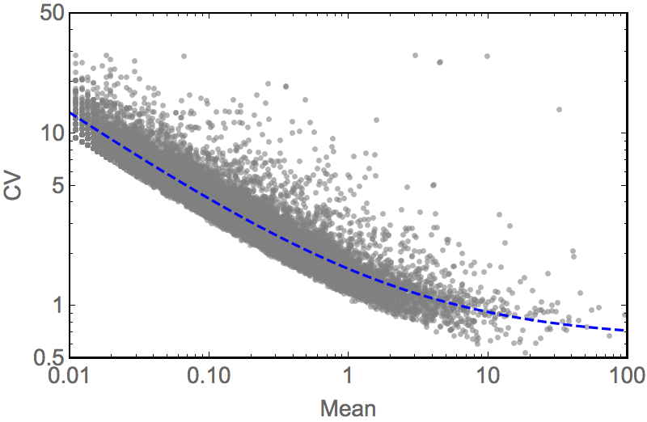

# Tutorial: feature selection

In order to achieve successful clustering using BackSPIN, it is crucial to select an informative subset of genes. If you attempt to cluster on too many genes, not only will clustering take a very long time, but it will also be fragmented and potentially misleading. If you select too few genes, you may be missing precisely those that are informative about biologically relevant subclasses of cells in your dataset.

As a rule, we perform *feature selection* (i.e. selecting a relevant subset of genes) by picking those genes that are *more variable than expected by their average expression levels*. To understand what this means, consider the plot below. It shows the CV (standard deviation divided by the mean) versus mean for all genes in the `oligos.cef` dataset. It's obvious that the CV depends on the mean by some slightly nonlinear function, on this log-log scale. 



A reasonable fit can often be obtained by fitting `log(CV) = log(mean<sup>k<sub>0</sub></sup> + k<sub>1</sub>)`, shown as the blue curve. For each gene, we can then calculate an offset from this line, which we call `noise`. The larger this value, the noisier the gene is relative to its expression level.


### Feature selection with BackSPIN

**Note:** This feature only works if you're running BackSPIN using Python, i.e. `python backSPIN.py [options]`, and you have `numpy`, `scipy` and `scikit-learn` installed. The binary versions do not support feature selection; in that case, use ceftools for feature selection.

Feature selection in BackSPIN is as easy as passing the `-f N` option, which will select the top N genes based on the noise criterion described above. In other words, to cluster the `oligos.cef` dataset based on the top 500 noisiest genes, do this:

```
python backSPIN.py -i oligos.cef -o oligos_clustered_500.cef -f 500 -d 3 -v
```

### Feature selection with ceftools

[Ceftools](https://github.com/linnarsson-lab/ceftools) is a general tool for manipulating CEF files. You can use it to easily calculate the `noise` as defined above, and then filter out the top noisiest genes. For that, you need to chain three commands: `cef aggregate` (to calculate noise), `cef sort` (to sort genes by noise) and `cef select` (to select the top N genes). Here's how:

```
< oligos.cef cef aggregate --noise std | cef sort --by Noise --reverse | cef select --range 1:500 > oligos_top500.cef
```

Then you can use this new file as input to BackSPIN (and this time, the binary backSPIN is fine:

```
backspin -i oligos_top500.cef -o oligos_clustered_500.cef -d 3 -v
```
